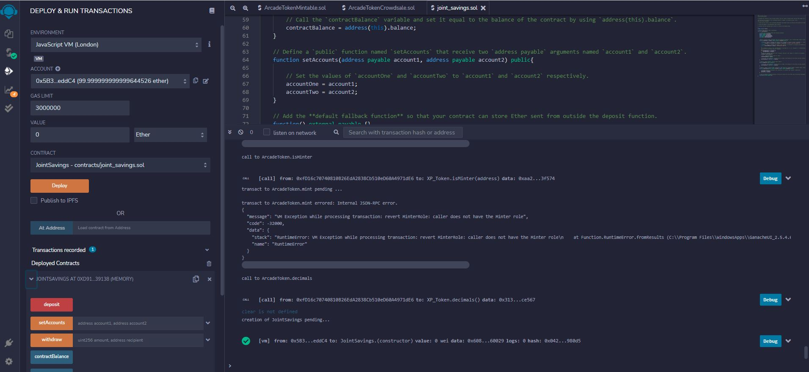

# SmartContract-JointSavings-
Automate the creation of joint savings accounts with a Solidity smart contract that accepts two user addresses.

## Interact with Your Deployed Smart Contract
Now that the contract is deployed, it’s time to test its functionality! After each step, capture a screenshot of the execution.
To interact with your deployed smart contract I followed the next steps:

Deploy the contract after compiling:

Use the setAccounts function to define the authorized Ethereum address that will be able to withdraw funds from your contract.

Note You can either use the following Ethereum addresses or create new, dummy addresses on the Vanity-ETH website, which includes an Ethereum vanity address generator.
Dummy account1 address: 0x0c0669Cd5e60a6F4b8ce437E4a4A007093D368Cb
Dummy account2 address: 0x7A1f3dFAa0a4a19844B606CD6e91d693083B12c0

Test the deposit functionality of your smart contract by sending the following amounts of ether. After each transaction, use the contractBalance function to verify that the funds were added to your contract:

Transaction 1: Send 1 ether as wei.

Transaction 2: Send 10 ether as wei.

Transaction 3: Send 5 ether.

Note Remembering how to convert ether to wei and vice versa can be challenging. So, you can use a website like Ethereum Unit Converter to ease doing the conversion.

Once you’ve successfully deposited funds into your contract, test the contract’s withdrawal functionality by withdrawing 5 ether into accountOne and 10 ether into accountTwo. After each transaction, use the contractBalance function to verify that the funds were withdrawn from your contract. Also, use the lastToWithdraw and lastWithdrawAmount functions to verify that the address and amount were correct.
